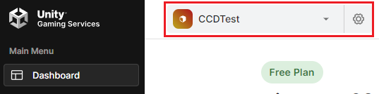
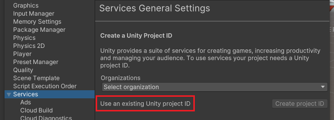
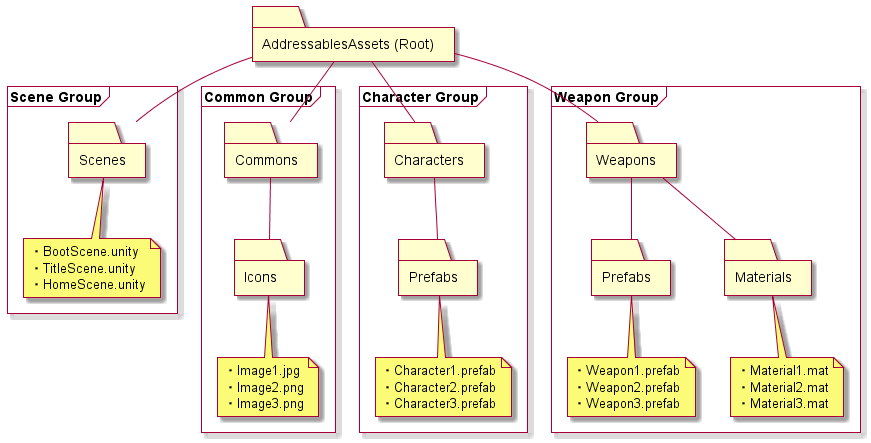
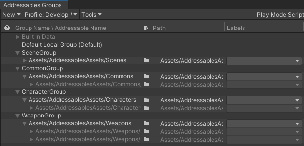
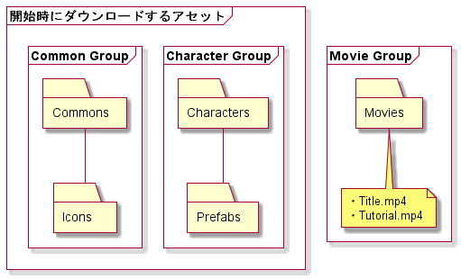
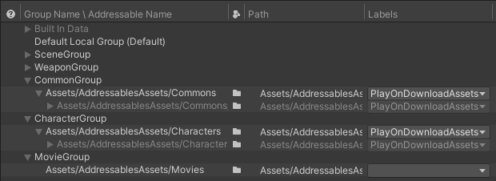

# 概要

アセットバンドルのフローには

- ビルドしてアセットバンドルの作成
- バンドルをサーバーへアップロード
- ゲーム時にサーバーからダウンロード＆ロード

の３つがございますが、一連のフローの方針とそれに伴う各種設定について以下にまとめます。

## wikiに記載している用語について

- Addressables
   - Unityでアセットを管理する**Addressable Asset System**のこと

- UGS
   - **Unityゲーミングサービス**のこと（Unity公式クラウドサービスの総称）

- CCD
   - **Cloud Content Delivery**のこと（サーバーでアセットを管理するサービス）  
   - UGSの様々なサービスのうちのひとつ

# 導入するパッケージ

- Addressables : ver 1.20.3

- CCD Management : ver 2.1.0
   - UnityからバンドルをCCDにアップロードする場合や、CCDに関する設定を行う場合に必要なパッケージです。

## バージョンに関する補足

**CCD Management**は**Addressables**の追加パッケージとして導入しますが、互いに連動するような仕組みになっているため、互いのバージョンが正しくないと、動作しない恐れがございます。  
そのため、インポート時に手動でバージョンを指定する必要がございますので、詳細については[こちら]()をご確認ください。

また、バージョンの選定については、[こちら](https://docs.unity.com/ccd/en/manual/UnityCCDManagementSDK#Installation_with_Addressables)の公式ドキュメントに則っております。

（TODO：インポートに関する詳細を別wikiにまとめる）

## 必須ではないが、導入したほうが良さそうなパッケージ

- UniTask
   - ゲーム中にAddressablesのアセットをロードする際に、非同期ロードが中心となるため、コーディングを楽にするため。
   - Unityの非同期関数では、AsyncOperationという独自機能で処理を待つ必要があるが、UniTaskを導入すると、これをC#のasync/awaitで待てるようになる。

# 初期設定

## UGSのプロジェクト設定

[こちら](https://dashboard.unity3d.com/gaming/)からUGSのダッシュボードに移動します。

赤枠からプロジェクトの新規追加や設定を行います。

## Unityにプロジェクトを登録

ビルドしたアセットバンドルのアップロードに伴い、UnityからCCDにアクセスすることになるため、事前にUGSで設定したプロジェクトをUnityに登録しておく必要があります。

**ProjectSettings**の**Service**から、UGSで設定した組織とプロジェクトを登録します。  
事前に**UnityHub**でログインしていれば、赤枠からそれぞれ登録できます。

**Link project ID**を押して、プロジェクト名やプロジェクトIDなどが表示されていれば成功です。

# アセットのビルド

## Addressableのグループ設定

アセットは上記のようなグループ構成を考えております。  
ロード時に一緒にロードされるであろうアセットを同じグループに追加しておくことで、グループ間の依存関係を少なくし、効率良くロードできる狙いがございます。

### グループの自動登録の仕組みを導入するか？

フォルダにアセットを追加した際に、自動でグループに登録される、自動インポートの仕組みを導入することも考えましたが、導入せずに手動で登録していく形でも問題ないと考えております。  
フォルダごと、まとめてグループに登録することが可能で、以降そのフォルダ以下に追加されたアセットは自動でグループに登録されるため、手動でも運用には支障はないかと思われます。

## グループのラベルの設定

